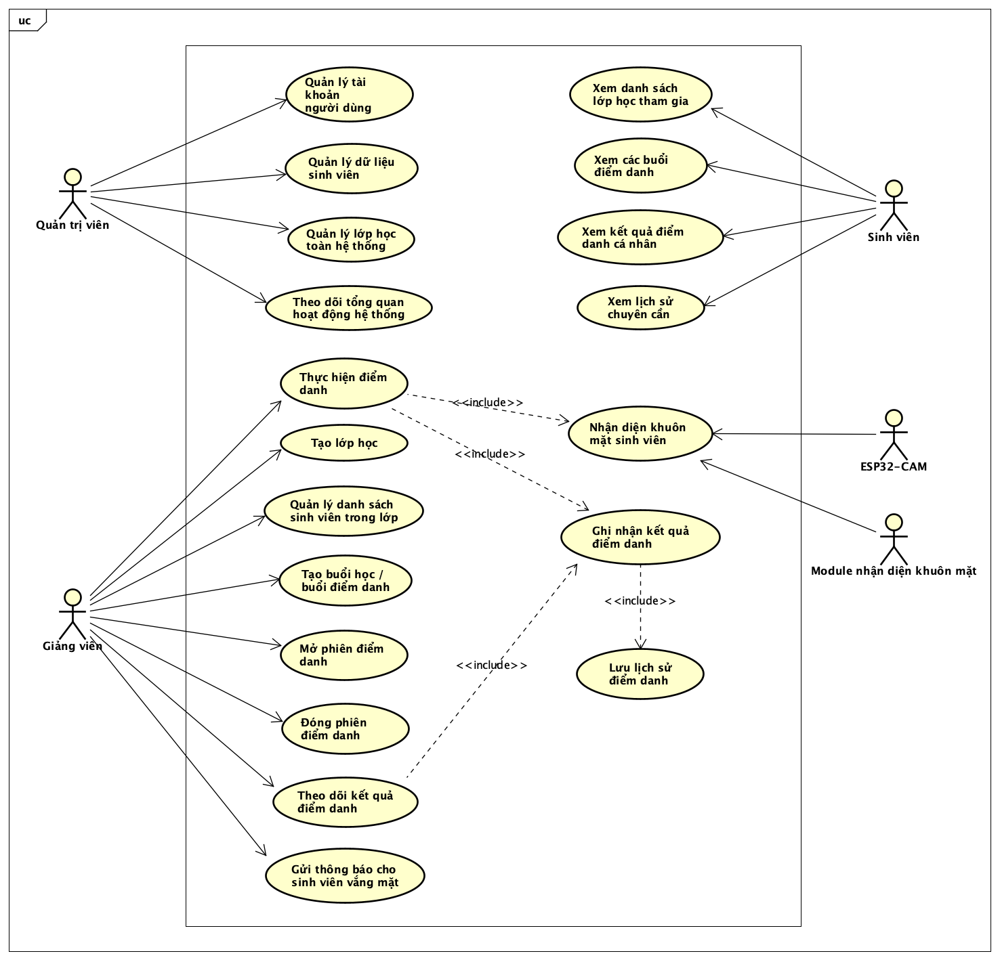

# 📅 Weekly Progress
## 👨‍🎓 Student Information
- Name: Lã Quốc Trung
- MSSV: 20236004

### Week 1
- Phân tích đề tài và xác định phạm vi hệ thống theo dõi chuyên cần dựa trên nhận dạng khuôn mặt
- Xác định các tác nhân (Actor) và các chức năng chính của hệ thống, bao gồm:
  - Thêm dữ liệu khuôn mặt sinh viên
  - Tạo vector đặc trưng (embedding)
  - Lưu trữ dữ liệu vector kèm MSSV
  - Giảng viên tạo lớp và thực hiện điểm danh bằng khuôn mặt
  - Nhận diện khuôn mặt từ ảnh đầu vào
  - So khớp và trả về kết quả nhận diện
  - Lưu trữ kết quả điểm danh trên hệ thống

- Xây dựng Use Case Diagram thể hiện:
  - Mối quan hệ giữa người dùng và hệ thống
  - Luồng tương tác chính khi sử dụng hệ thống
  - Các chức năng cốt lõi phục vụ bài toán theo dõi chuyên cần

- Nghiên cứu project mẫu face2face do giảng viên cung cấp:
  - Chạy thử code và tìm hiểu cách tổ chức code
  - Phân tích các file chính và chức năng tương ứng
  - Tìm hiểu quy trình xử lý dữ liệu:
    - Ảnh đầu vào → xử lý → trích xuất đặc trưng → lưu vector
  - Đọc và phân tích cách hệ thống thực hiện việc so khớp khuôn mặt
  - Phân tích cách tách dữ liệu từ file db_split để phục vụ mục đích chia lớp
  
**Kết quả:**
- Xác định rõ các chức năng cần thiết để triển khai hệ thống
- Xây dựng được Use Case Diagram phản ánh đúng yêu cầu bài toán
- Nắm được pipeline tổng quát của hệ thống nhận diện:
  - Input image → Feature extraction (Facenet) → Vector → So sánh
- Hiểu được vai trò của vector embedding trong việc nhận diện khuôn mặt
- Có cái nhìn tổng quan về cách triển khai hệ thống từ project mẫu

**Khó khăn:**
- Chưa nắm rõ cách lấy ra 512 vector đặc trưng của từng khuôn mặt
- Chưa nắm rõ chi tiết cách tính toán độ tương đồng giữa các vector (cosine similarity, threshold)

**Kế hoạch tuần sau:**
- Tiếp tục phân tích chi tiết project mẫu:
  - Làm rõ cách thuật toán hoạt động
  - Hiểu rõ cách tạo và quản lý database vector

- Bắt đầu triển khai thử nghiệm:
  - Tách file dữ liệu vector của > 90.000 sinh viên theo lớp 
  - Thử nghiệm so sánh khuôn mặt với các sinh viên trong lớp và ước tính độ chính xác

- Đánh giá bước đầu:
  - Kiểm tra độ chính xác khi nhận diện
  - Xác định các vấn đề cần tối ưu trong các bước tiếp theo

**Usecase Diagram:**

