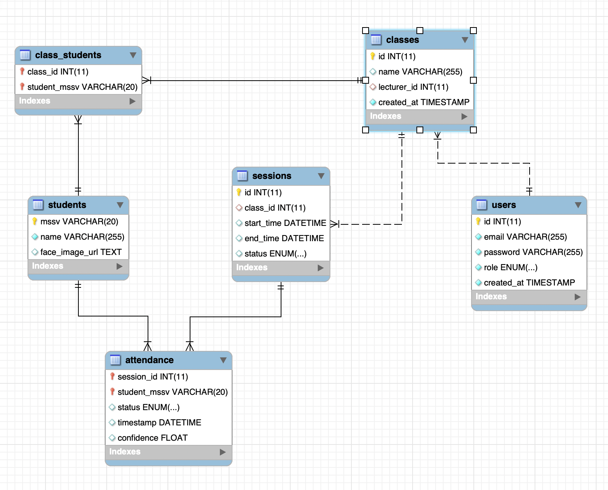

# 📅 Weekly Progress
## 👨‍🎓 Student Information
- Name: Lã Quốc Trung
- MSSV: 20236004

### Week 2
- Thiết kế và xây dựng cơ sở dữ liệu cho hệ thống:
  - Xây dựng các bảng chính:
    - Users
    - Students
    - Classes
    - Class_Students
    - Sessions
    - Attendance
  - Sử dụng MSSV làm khóa chính cho bảng Students
  - Áp dụng composite key cho:
    - class_students (class_id, student_mssv)
    - attendance (session_id, student_mssv)
  - Thiết kế quan hệ giữa các bảng phục vụ cho việc quản lý lớp và điểm danh

- Xây dựng backend cơ bản bằng Node.js:
  - Khởi tạo project và cấu trúc thư mục:
    - routes/
    - middleware/
    - db.js
    - server.js
  - Cài đặt các thư viện cần thiết:
    - express
    - mysql2
    - jsonwebtoken
    - bcrypt
    - dotenv

- Kết nối backend với cơ sở dữ liệu:
  - Tạo file .env để quản lý thông tin cấu hình
  - Thiết lập kết nối giữa Node.js và MariaDB
  - Kiểm tra kết nối và truy vấn dữ liệu thành công

- Xây dựng chức năng xác thực người dùng:
  - Implement API login:
    - POST /auth/login
  - Sử dụng bcrypt để mã hóa mật khẩu
  - Sử dụng JWT để xác thực và phân quyền người dùng
  - Tạo script để tạo user test phục vụ kiểm thử

- Xây dựng API quản lý lớp học:
  - Tạo lớp học:
    - POST /classes
  - Thêm sinh viên vào lớp bằng MSSV:
    - POST /classes/{id}/students
  - Xử lý logic:
    - Nhận danh sách MSSV
    - Truy vấn bảng students
    - Liên kết sinh viên với lớp trong bảng class_students

- Xây dựng API quản lý buổi học:
  - Tạo buổi học:
    - POST /sessions
  - Mở điểm danh:
    - PUT /sessions/{id}/open
  - Đóng điểm danh:
    - PUT /sessions/{id}/close

- Xây dựng API điểm danh (mock):
  - POST /attendance/recognize
  - Sử dụng dữ liệu giả để kiểm thử luồng hệ thống
  - Chưa tích hợp phần nhận diện khuôn mặt

**Kết quả:**
- Hoàn thiện thiết kế cơ sở dữ liệu cho hệ thống
- Backend đã chạy ổn định và kết nối được với database
- Xây dựng được các API phục vụ:
  - Đăng nhập
  - Tạo lớp
  - Thêm sinh viên
  - Tạo buổi học
  - Mở/đóng điểm danh
- Kiểm thử API thành công bằng Postman
- Xây dựng được luồng xử lý cơ bản của hệ thống từ backend

**Khó khăn:**
- Chưa tích hợp được module nhận diện khuôn mặt vào backend

**Kế hoạch tuần sau:**
- Tích hợp module nhận diện khuôn mặt từ project face2face vào backend
- Xây dựng chức năng tách dữ liệu vector theo từng lớp (class_A.pkl)
- Kết nối API nhận diện với hệ thống điểm danh
- Thử nghiệm luồng hoàn chỉnh:
  - Input ảnh → nhận diện → xác định MSSV → lưu attendance
- Đánh giá hiệu năng và độ chính xác khi giới hạn tập sinh viên theo lớp

**Database Design:**

